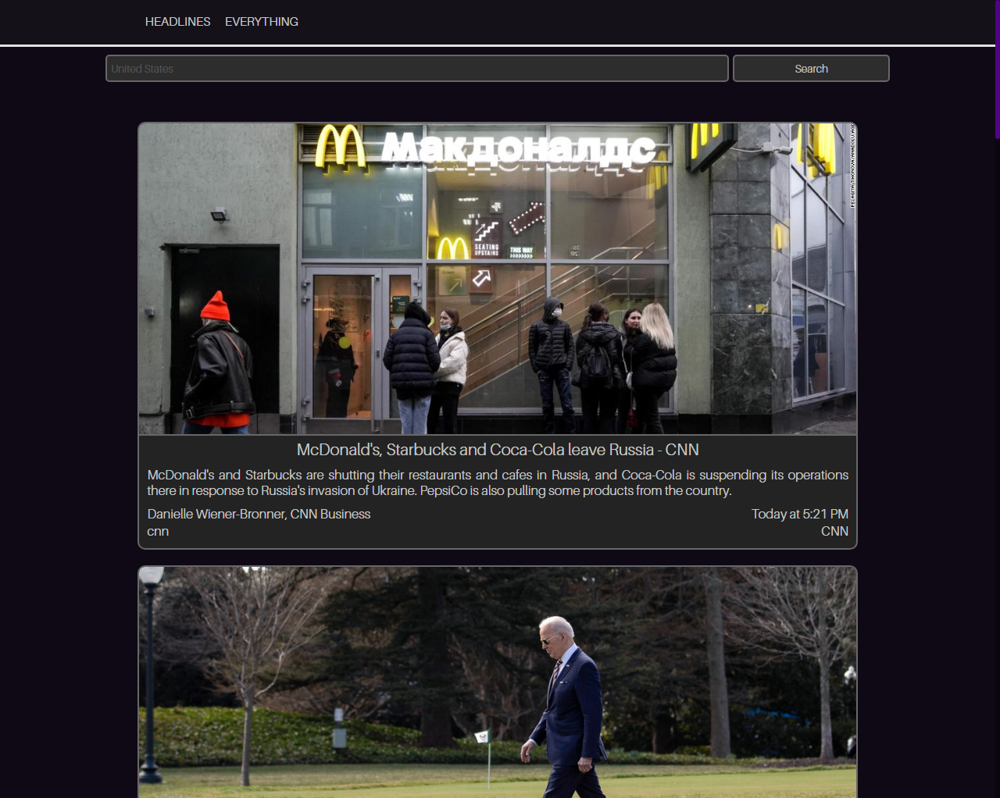

# ShizukaNews on Webpack-ReactJS-Babel (SPA)
Small test web application on ReactJS + Webpack + Babel.
## How to run application
1. Install the dependencies. 
```
npm install
```
2. Build project.
```
npm run build
```
3. Add the "dist" folder as a site on your web server.
4. Open the site hosted on your web server.
## Development
npm run scripts:
* dev - run app in dev mode.
* dev-test-data - run the application in dev mode with test data for requests.
* debugwebpackservdev-* - debug webpack configurations
## About
Support:
* JavaScript chunks and externals
* SASS/SCSS and CSS (Processable modules and static): minification, compressing, hashing, obfuscation
* Environment configs
* Defines config vars
* Code separation: Debug, Test data, Release
* Resource processing: images, fonts, files etc
* Using NewsAPI and test data
* etc...
## Screen
